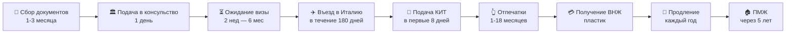

# 🇮🇹 Виза цифрового кочевника в Италию — Полный гайд

> **Актуальность:** февраль 2026 г.  
> **Источники:** Gazzetta Ufficiale, integrazionemigranti.gov.it, реальные кейсы из чата «Digital Nomad Italy»

---

## Что такое виза Digital Nomad?

С апреля 2024 года Италия выдаёт **национальную визу D** для цифровых кочевников и удалённых работников (**Nomadi digitali e lavoratori da remoto**). Правовая основа — декрет, опубликованный в [Gazzetta Ufficiale 04.04.2024](https://www.gazzettaufficiale.it/eli/id/2024/04/04/24A01716/sg).

**Проще говоря:** если вы работаете удалённо на компанию или клиентов за пределами Италии и зарабатываете достаточно (от ~25 000 €/год, сумма индексируется) — эта виза позволяет легально жить в Италии. Она отличается от туристической (позволяет находиться дольше 90 дней) и от рабочей (не требует итальянского работодателя). По приезду оформляется [ВНЖ (Permesso di Soggiorno)](04-04-glossary.md#permesso), который можно продлевать, а через 5 лет — получить ПМЖ.

---

## Для кого эта виза

Виза подходит если вы:

- 👨‍💻 **Наёмный сотрудник** — работаете удалённо на компанию вне Италии
- 📋 **Контрактор / фрилансер** — работаете по контрактам с заказчиками вне Италии
- 🏢 **ИП / самозанятый** — ведёте бизнес удалённо, клиенты за рубежом

> [!IMPORTANT]
> Виза **не позволяет** работать на итальянского работодателя. Все доходы должны быть из-за рубежа.

---

## Общая дорожная карта

---

## Ключевые цифры

| Параметр | Значение |
|----------|----------|
| Минимальный доход | 3× мин. зарплаты (~25–28 000 € в 2024 г., **индексируется ежегодно**) |
| Опыт удалённой работы | не менее 6 месяцев |
| Срок визы D | до 1 года |
| Срок ВНЖ | 1 год (продлевается) |
| Путь к ПМЖ | 5 лет легального проживания |
| Путь к гражданству | 10 лет (возможно 5, если пройдёт референдум) |
| Стоимость процесса | ~2 000–3 000 € (всего, включая помощь) |

---

## 📖 Как пользоваться этим гайдом

**Маркировка информации:**
- 🟢 — официальная информация из декрета или оф. сайтов
- 🟡 — проверено на практике (кейсы из чата), но может меняться
- 🔴 — спорно, противоречивые данные или риск

**Ссылки на источники:** в квадратных скобках указаны имя, дата и маркер надёжности — например: [🟡 Elena Kerimli, октябрь 2024].

**Термины:** все специальные термины (КИТ, Nulla Osta, ричевута, DDV и др.) расшифрованы в [Глоссарии](04-04-glossary.md).

---

## 📅 Хронология визы Digital Nomad

| Дата | Событие |
|------|----------|
| Апрель 2024 | Декрет опубликован в [Gazzetta Ufficiale](https://www.gazzettaufficiale.it/eli/id/2024/04/04/24A01716/sg) |
| Лето 2024 | Консульства начинают принимать заявления (Москва, Белград) |
| Осень 2024 | Первые успешные кейсы (Elena Kerimli, Kira Gimaletdinova, Nick Gushchin) |
| 2025 | Стабилизация практики. Отказы по жилью (Белград). Воссоединение семей теперь только через Nulla Osta |
| Январь 2025 | Конституционный суд: референдум о гражданстве за 5 лет (вместо 10) |

> [!NOTE]
> Информация из ранних кейсов (апрель–2024) может быть устаревшей. Практика консульств меняется — мы стараемся отмечать даты кейсов и источников.

## Что вы можете и чего не можете

### ✅ Можно
- Жить в любом регионе Италии
- Путешествовать по Шенгену (90/180 дней по визе D)
- Менять работодателя / заказчика
- Воссоединиться с семьёй (нужна [Nulla Osta](04-04-glossary.md#nulla-osta))
- Открыть [итальянское ИП (Partita IVA)](04-04-glossary.md#contratto) для уплаты налогов
- После 5 лет — получить ПМЖ

### ❌ Нельзя
- Подавать из Италии (только из консульства за рубежом)
- Работать на итальянского работодателя (даже через своё ИП)
- Конвертировать ВНЖ номада в другой тип ВНЖ

---

## Маркировка информации

В этом гайде используется система маркировки надёжности информации:

- 🟢 **Официально** — из законодательства, сайтов консульств, integrazionemigranti.gov.it
- 🟡 **Из опыта** — подтверждено реальными кейсами из чата, но не закреплено официально
- 🔴 **Спорно** — противоречивая информация, разные кейсы показывают разные результаты

---

## Содержание гайда

### Раздел 1: Получение визы
1. [Требования](01-01-requirements.md) — кто может подавать, доход, квалификация
2. [Документы](01-02-documents.md) — полный чеклист документов
3. [Консульства](01-03-consulates.md) — где подавать, особенности по странам
4. [Процесс подачи](01-04-application-process.md) — пошаговый процесс
5. [Нюансы и FAQ](01-05-visa-nuances.md) — частые вопросы и подводные камни

### Раздел 2: По приезду (Permesso)
6. Первые шаги в Италии — что делать после прилёта
7. Квестура и КИТ — подача на ВНЖ
8. Процесс получения пермессо — от подачи до пластика

### Раздел 3: Жизнь в Италии
9. Продление ВНЖ
10. Налоги — системы налогообложения, декларирование
11. Страховка — медицинская, SSN
12. Семья и воссоединение
13. Банки и финансы
14. Жильё — аренда, контракты
15. Путь к ПМЖ и гражданству

### Справочник
16. Реальные кейсы — таймлайны и истории
17. Полезные ссылки
18. [📖 Глоссарий](04-04-glossary.md) — все итальянские термины с объяснениями

---

> [!NOTE]
> Этот гайд основан на информации, актуальной на февраль 2026 года. Программа Digital Nomad в Италии — относительно новая, и практики могут меняться. Всегда проверяйте актуальную информацию на сайте консульства вашей страны.
