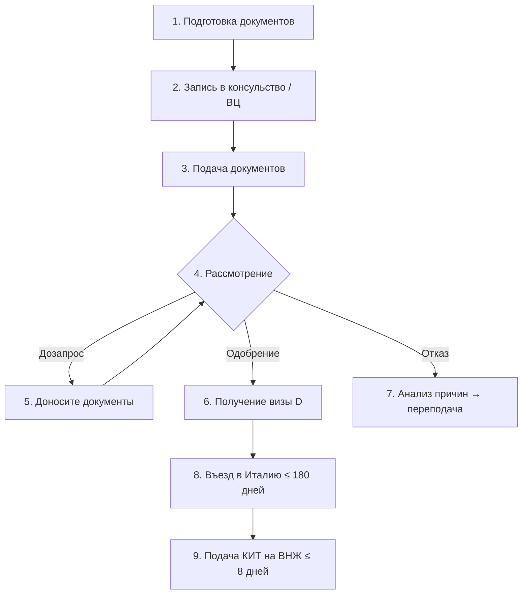
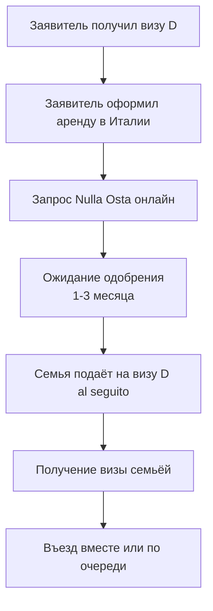

# Процесс подачи на визу Digital Nomad

> **Раздел 1, Статья 4** | [← Консульства](01-03-consulates.md) | [Нюансы →](01-05-visa-nuances.md)

---

## 💰 Расходы по шагам

🟡 Примерная стоимость процесса (без учёта жилья в Италии):

| Статья расходов | Примерная сумма | Комментарий |
|---|---|---|
| Консульский сбор (виза D) | €116 | Стандартный сбор |
| Сервисный сбор ВЦ (VMS/Almaviva) | €30–50 | Если подаёте через ВЦ, а не напрямую |
| Переводы документов на итальянский | €200–500 | Зависит от количества документов |
| Апостиль (справка о несудимости, диплом) | ~₳2 500 за каждый | В РФ, через Минюст/МВД |
| DDV (если нужен) | Разно | Зависит от консульства |
| Страховка ВЗР | Разно | Зависит от полиса и срока |
| Помощь помогатора (опционально) | €300–1 000 | Зависит от сложности кейса |
| **Итого (без жилья)** | **~€500–1 500** | Кейс Tanya Kaufman: ~€2 500 за 2 визы + Nulla Osta |

> [!WARNING]
> Суммы приблизительные и могут меняться. Уточняйте актуальные тарифы на сайтах [VMS](https://italy-vms.ru/) и [Almaviva](https://ru.almaviva-visa.services/).

---

## Общая схема процесса

---

## Шаг 1: Подготовка документов (1–3 месяца)

### Таймлайн подготовки

| Неделя | Действие |
|--------|----------|
| 1–2 | Собрать документы от работодателя (контракт, ведомости, автодекларация) |
| 2–3 | Заказать справку о несудимости |
| 3–4 | Получить апостиль на несудимость и диплом |
| 4–6 | Перевести все документы на итальянский |
| 5–6 | Оформить DDV / CIMEA (если нужно) |
| 6–8 | Оформить страховку, подготовить жильё |
| 8–10 | Собрать два комплекта, написать сопроводительное письмо |

> [!TIP]
> «Рекомендую собрать все пункты в большую Excel-таблицу — будет много деталей, которые нужно держать в голове» — A., участник чата

### Подготовка жилья

Варианты (от лучшего к худшему):

1. **Контракт аренды** — заключить заранее, удалённо (через агента или знакомых)
2. **Ospitalità** — письмо-приглашение от человека с жильём в Италии
3. **Бронь отеля** — на Booking.com, обязательно с возможностью бесплатной отмены

🟡 Если используете букинг — **не отменяйте** до получения визы. Указывайте в сопроводительном письме планы по аренде.

---

## Шаг 2: Запись в консульство

### Через визовый центр (Москва, и др.)

1. Зайти на сайт ВЦ (VMS, Almaviva)
2. Записаться на приём по категории «Visa D / National visa»
3. Сроки ожидания записи — обычно 1–2 недели

### Напрямую в консульство (Белград, Ереван)

1. Записаться через систему **Prenot@mi** ([prenotami.esteri.it](https://prenotami.esteri.it/))
2. Или написать на email консульства
3. 🟡 В Ереване — запись на visa D свободна, «буквально на следующий день»

> [!NOTE]
> «На visa D — буквально сегодня можно записаться на следующий день» — Denisio, Ереван (июнь 2025)

---

## Шаг 3: Подача документов

### Что взять с собой

- ✅ Два комплекта документов (оригинал + копия)
- ✅ Загранпаспорт (оригинал)
- ✅ Заполненную анкету
- ✅ Фото 2 шт
- ✅ Оплату консульского сбора (если есть)

### Как проходит подача

**В визовом центре (VMS):**
- Приём длится 20–30 минут
- Менеджер проверяет комплектность
- Один пакет уходит в консульство, второй возвращают

**В консульстве напрямую (Белград):**
- Может быть собеседование с консулом
- 🟡 «Генеральный консул лично сказал, что я первая на digital nomad, собеседовал 3 часа, бегал звонить в Рим» — Ol'ka, Белград

---

## Шаг 4: Ожидание решения

### Официальные сроки

🟢 По декрету:
- **Наёмные сотрудники:** до 90 дней
- **Фрилансеры / ИП:** до 120 дней
- **Максимум:** до 180 дней (по усмотрению)

### Реальные сроки

| Срок | Кейсы |
|------|-------|
| **2 недели** | Elena Kerimli (Москва), Olga (Москва), Daria (Москва) |
| **3 недели** | Nick Gushchin (Москва) |
| **6 недель** | Kira Gimaletdinova (Москва) |
| **52 дня** | Илья O(1) (неизвестно) |
| **~2 месяца** | Роман Береговский (Дубай) |
| **~4 месяца** | Ol'ka (Белград) |
| **~6 месяцев** | Отдельные кейсы |

🟡 «На сроки влияют только звёзды. Логики рассмотрения заявок вообще нет 😅» — Наталья Сохарева

### Как отслеживать статус

- **VMS Москва:** проверка статуса на сайте центра
- **Др. консульства:** по email или телефону (если отвечают)

---

## Шаг 5: Дозапрос документов

🟡 Консульство может запросить дополнительные документы. Это **нормально**, не паникуйте.

### Что делать при дозапросе

1. Получить список того, что нужно (обычно по email)
2. Подготовить документы
3. Доставить в ВЦ или консульство

### Типичные дозапросы

- Налоговая декларация (если не предоставили)
- Уточнения по жилью
- Письмо от работодателя
- Страховка на полный срок (вместо короткой)

> [!WARNING]
> 🟡 Есть информация, что некоторые консульства в 2025 году **перестали делать дозапросы** — если чего-то не хватает, сразу отказывают. В таком случае можно переподаться с доработанным пакетом.

---

## Шаг 6: Получение визы

При одобрении:
- Визу D вклеивают в загранпаспорт
- Виза действует **до 1 года**
- Даты указывают с учётом ваших планов (если указывали желаемые даты)

### После получения визы

1. **Спланировать въезд** — в течение первых 180 дней от начала визы
2. **Подготовить [КИТ](04-glossary.md#kit)** — почтовый конверт для подачи заявления на ВНЖ
3. **Найти жильё** — если ещё нет [контракта аренды](04-glossary.md#contratto)
4. **Начать процесс [Nulla Osta](04-glossary.md#nulla-osta)** — если едете с семьёй

---

## Шаг 7: При отказе

🟡 Если отказали:

1. **Проанализировать причину** — в отказе обычно указывают, чего не хватило
2. **Дополнить/исправить пакет**
3. **Переподаться** — можно в том же или другом консульстве

### Типичные причины отказов

| Причина | Как исправить |
|---------|---------------|
| Недостаточное подтверждение жилья | Заключить контракт аренды |
| «Не обоснована причина переезда» | Более подробное сопроводительное письмо |
| Сомнения в доходах | Больше выписок, деклараций |
| Букинг вместо контракта | Оформить реальную аренду |

🟡 Кейс: девушке отказали в Белграде за бесплатный контракт на жильё. Переподалась в Москве — получила.

🟡 Кейс отказа с формулировкой: «Non è stata fornita idonea giustificazione sul motivo del trasferimento in Italia come Nomade Digitale» — даже при «идеальном» профиле кочевника.

---

## Воссоединение с семьёй (Al Seguito)

> [!NOTE]
> **Что такое Nulla Osta?** Это разрешение от итальянских органов, которое позволяет вашей семье получить визу для въезда в Италию. Без Nulla Osta семья не может получить визу D «al seguito» (сопровождение). Запрашивается **онлайн** через портал единого иммиграционного окна (Sportello Unico per l’Immigrazione).

🟢 Семья (супруг/а, дети) может получить визу D «al seguito» (сопровождение):

### Процесс

### Важные нюансы

- 🟡 **По шенгену уже нельзя** — раньше семья могла въехать по обычной шенгенской визе, теперь нужна Nulla Osta
- 🟡 Nulla Osta запрашивается **онлайн** через портал единого иммиграционного окна — не нужно ездить лично
- 🟡 Нужен контракт аренды + **[сертификат пригодности жилья (idoneità alloggiativa)](04-glossary.md#idoneita)**
- 🟡 Помните: по визе D нужно въехать в течение 180 дней — планируйте с запасом!
- 💰 Tanya Kaufman: Nulla Osta ждали ~90 дней, визу мужу в Ереване сделали за 18 дней

### Альтернативный путь (ricongiungimento familiare)

🟢 Можно воссоединить семью после **2 лет** легального проживания в Италии. На практике этот путь почти не используют — слишком долго.

---

## Таймлайн реального кейса

> **Tanya Kaufman — полный цикл с семьёй:**

| Дата | Этап |
|------|------|
| Март 2025 | Начало подготовки документов |
| Лето 2025 | Подача на визу (Ереван) |
| ~3 мес | Ожидание визы |
| Декабрь 2025 | Запрос Nulla Osta для мужа (через rutoitaly) |
| 90 дней | Ожидание Nulla Osta |
| Декабрь 2025 | Виза мужу (18 дней) |
| **Итого** | **~9 месяцев, ~2 500 €** |

---

> **Далее:** [Нюансы и FAQ →](01-05-visa-nuances.md)
